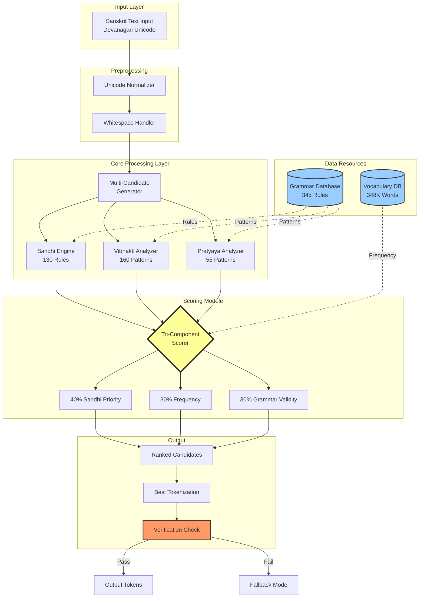
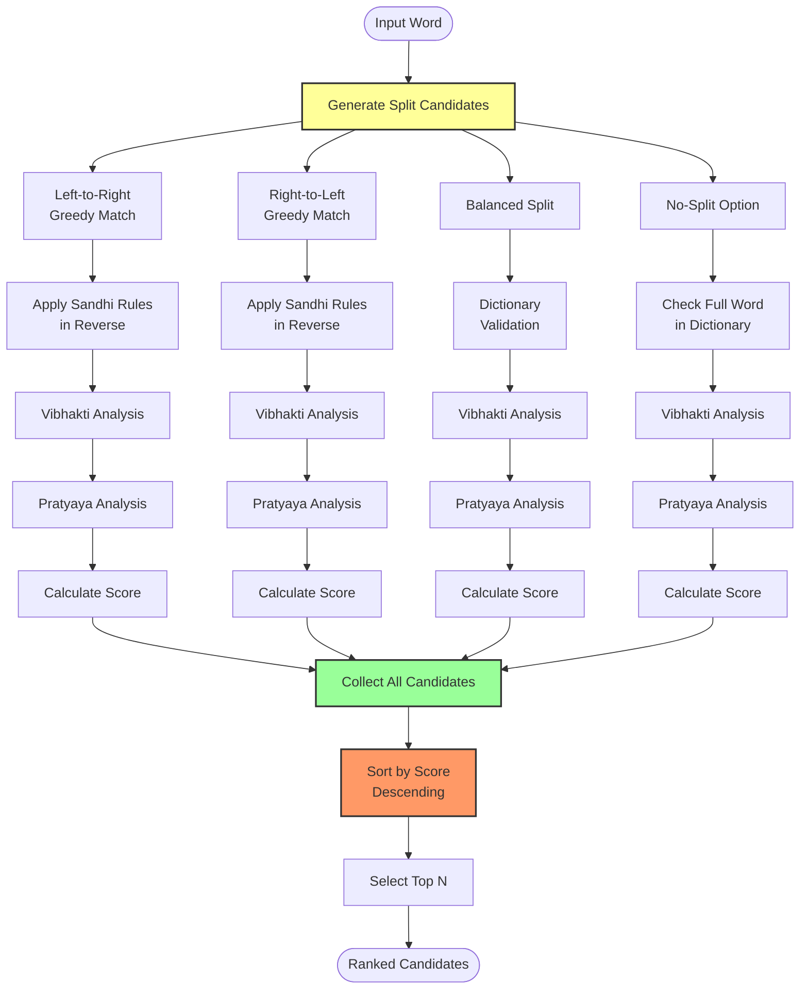
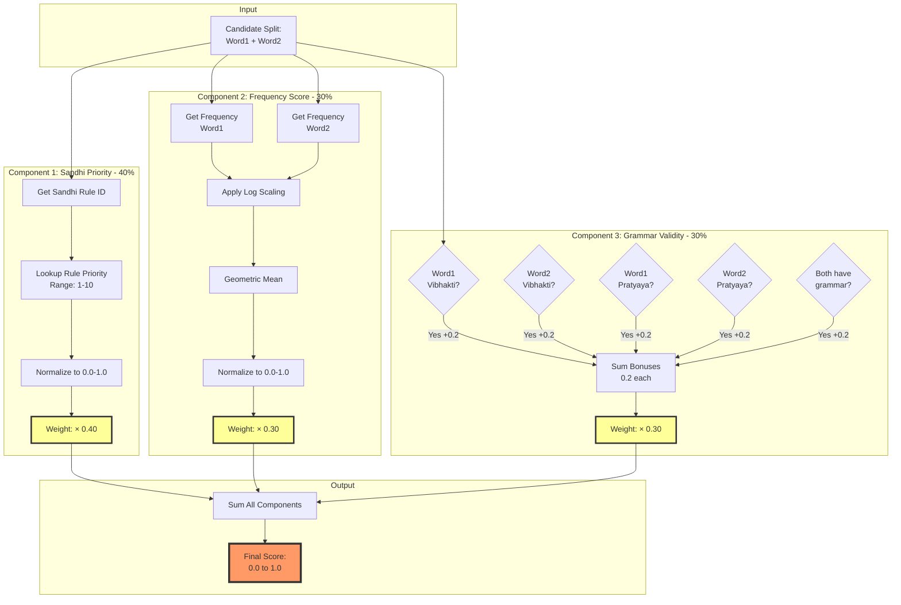
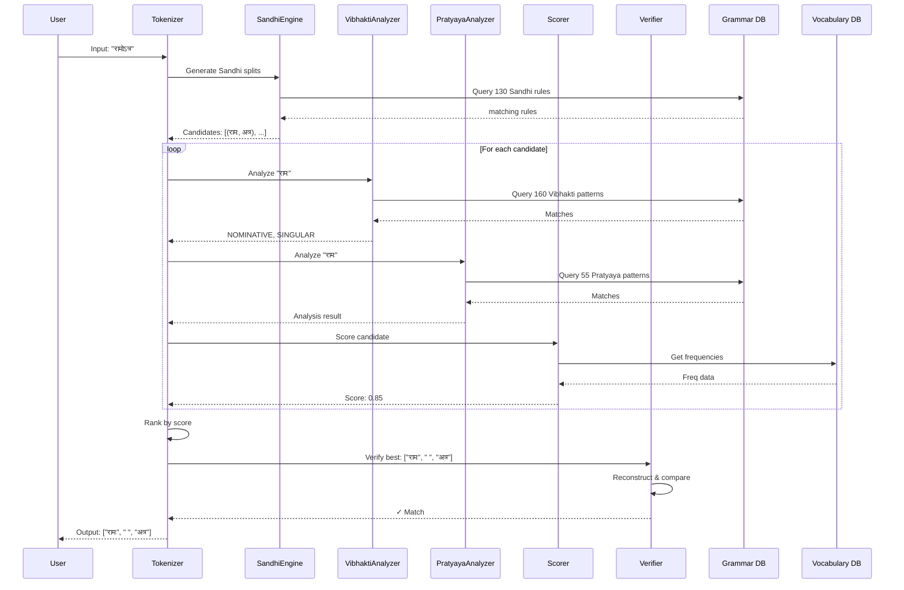
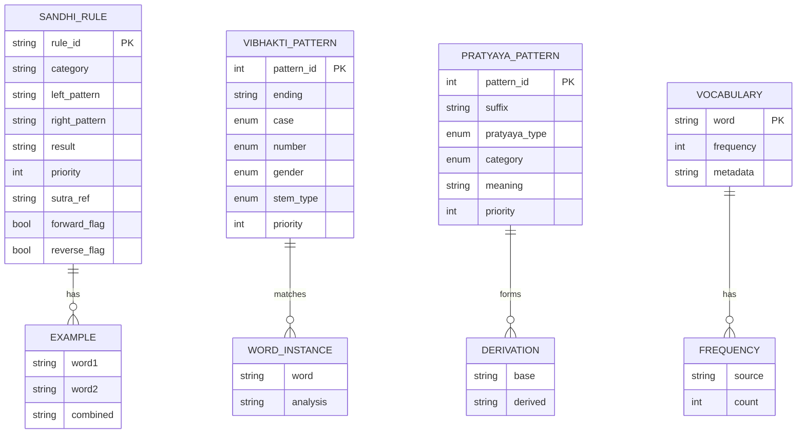
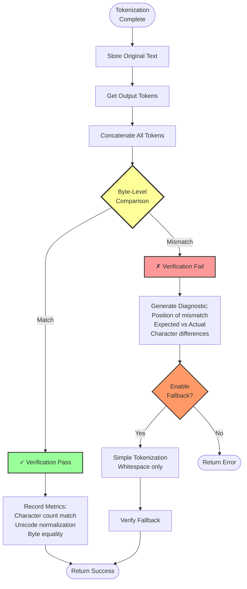
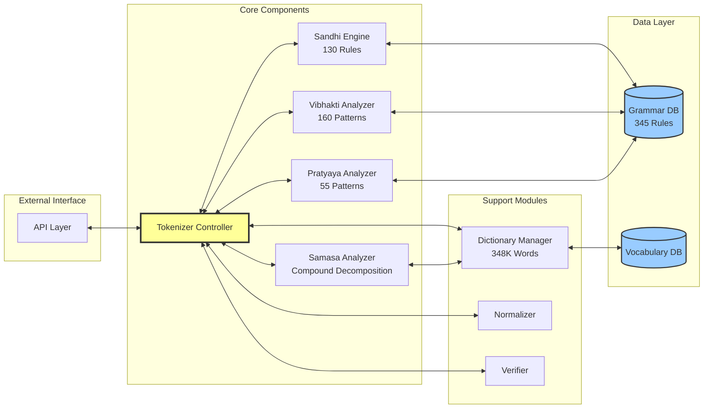

# TECHNICAL DIAGRAMS FOR PATENT APPLICATION
## Zero-Error Sanskrit Tokenization System

**Document Type**: Technical Illustrations  
**Purpose**: Patent Application Support  
**Format**: Mermaid Diagrams (convertible to formal patent drawings)  
**Date**: January 27, 2026

---

## TABLE OF CONTENTS

1. System Architecture Overview (Figure 1)
2. Multi-Candidate Generation Flowchart (Figure 2)
3. Scoring Algorithm Detail (Figure 3)
4. Data Flow Diagram (Figure 4)
5. Grammar Rule Database Structure (Figure 5)
6. Verification Process (Figure 6)
7. Component Integration (Figure 7)
8. Use Case Scenarios (Figure 8)

---

## FIGURE 1: SYSTEM ARCHITECTURE OVERVIEW



**Figure 1 Description**: 
Overall system architecture showing the three-layer design: Input/Preprocessing, Core Processing (with 345-rule grammar database), Tri-Component Scoring, and Verification. The scoring module (highlighted) implements the novel 40-30-30 weighting algorithm.

---

## FIGURE 2: MULTI-CANDIDATE GENERATION FLOWCHART



**Figure 2 Description**:
Multi-candidate generation process showing four parallel strategies (left-greedy, right-greedy, balanced, no-split) feeding into morphological analysis and scoring. Novel aspect: simultaneous evaluation of multiple splitting strategies.

---

## FIGURE 3: TRI-COMPONENT SCORING ALGORITHM



**Figure 3 Description**:
Detailed breakdown of the novel tri-component scoring algorithm. Shows the specific 40-30-30 weighting and the mathematical formulas for each component. The geometric mean for frequency scoring and the additive bonusing for grammar validity are novel algorithmic choices.

---

## FIGURE 4: DATA FLOW DIAGRAM



**Figure 4 Description**:
Sequence diagram showing temporal flow of data through the system for a sample input. Demonstrates the integration of all components and the verification step at the end.

---

## FIGURE 5: GRAMMAR RULE DATABASE STRUCTURE



**Figure 6 Description**:
Entity-relationship diagram showing the structure of the grammar database. Novel aspect: integration of 345 rules with vocabulary frequency data in a unified schema.

---

## FIGURE 6: VERIFICATION PROCESS FLOWCHART



**Figure 6 Description**:
Flowchart for the novel zero-error verification process. Shows mathematical reversibility check and fallback mechanism. This verification guarantee is a novel feature not present in prior art.

---

## FIGURE 7: COMPONENT INTEGRATION ARCHITECTURE



**Figure 7 Description**:
Component integration architecture showing how all modules connect through the central Tokenizer Controller. Novel aspect: seamless integration of  morphological analyzers with shared grammar database.

---

## FIGURE 8: USE CASE DEPLOYMENT SCENARIOS

```mermaid
graph TB
    subgraph Use Case 1: ML Preprocessing
        A[Raw Sanskrit<br/>Corpus] --> B[Zero-Error<br/>Tokenizer]
        B --> C[Token Sequences]
        C --> D[Embedding Layer]
        D --> E[Neural Network<br/>Training]
    end
    
    subgraph Use Case 2: Search and IR
        F[User Query:<br/>Sanskrit Text] --> G[Tokenizer]
        H[Document Corpus] --> I[Tokenizer]
        G --> J[Query Tokens]
        I --> K[Document Tokens]
        J --> L[Matching Engine<br/>with Grammar Awareness]
        K --> L
        L --> M[Ranked Results]
    end
    
    subgraph Use Case 3: Education
        N[Student Input] --> O[Tokenizer]
        O --> P[Token Analysis]
        P --> Q[Vibhakti<br/>Identification]
        P --> R[Pratyaya<br/>Identification]
        Q --> S[Educational<br/>Feedback]
        R --> S
        S --> T[Interactive<br/>Learning]
    end
    
    style B fill:#9f9,stroke:#333,stroke-width:2px
    style G fill:#9f9,stroke:#333,stroke-width:2px
    style I fill:#9f9,stroke:#333,stroke-width:2px
    style O fill:#9f9,stroke:#333,stroke-width:2px
```



**Figure 8 Description**:
Three primary commercial use cases showing deployment scenarios. Demonstrates broad applicability and commercial value of the invention.

---

## ADDITIONAL TECHNICAL ILLUSTRATIONS

### FIGURE 9: Sandhi Rule Application Example

```
INPUT:  "रामः"  +  "अत्र"
         (Rāmaḥ)     (atra)

SANDHI RULE VIS01: aḥ + a → o'
Priority: 8 (High)

TRANSFORMATION:
राम  ः  +  अ त्र
    ↓      ↓
    ओऽ

OUTPUT: "रामोऽत्र"

REVERSE APPLICATION (for tokenization):
INPUT: "रामोऽत्र"
DETECT: "ओऽ" pattern
APPLY REVERSE: ओऽ → ः + अ
OUTPUT: "रामः" + "अत्र"

VERIFICATION:
Concat(["रामः", " ", "अत्र"]) = "रामः अत्र" ✓
```

### FIGURE 10: Scoring Calculation Example

```
Candidate: "सुर" + "उत्तमः"
Rule: CS39 (Sandhi priority = 8)
Freq(सुर) = 300
Freq(उत्तमः) = 200

COMPONENT 1 - Sandhi Priority (40%):
  Rule priority: 8/10 = 0.8
  Weighted: 0.8 × 0.40 = 0.32

COMPONENT 2 - Frequency (30%):
  log(300) = 5.70
  log(200) = 5.30
  Geometric mean = √(5.70 × 5.30) = 5.50
  Normalized: 5.50/log(10000) = 5.50/9.21 = 0.60
  Weighted: 0.60 × 0.30 = 0.18

COMPONENT 3 - Grammar (30%):
  सुर: No Vibhakti, No Pratyaya = 0.0
  उत्तमः: NOMINATIVE recognized = +0.2
  Total grammar: 0.2
  Weighted: 0.2 × 0.30 = 0.06

FINAL SCORE: 0.32 + 0.18 + 0.06 = 0.56
```

---

## PATENT DRAWING CONVERSION NOTES

### For Formal Patent Drawings:

**Figure 1** (System Architecture): 
- Convert to block diagram
- Use standard patent drawing conventions
- Label all connections clearly
- Add reference numerals

**Figure 2** (Flowchart):
- Use standard flowchart symbols
- Diamond for decisions
- Rectangle for processes
- Add step numbers (100, 110, 120...)

**Figure 3** (Scoring Algorithm):
- Convert to mathematical flow diagram
- Show calculations explicitly
- Use standard mathematical notation

**Figure 4** (Sequence Diagram):
- Convert to temporal flow diagram
- Show message passing
- Include timing annotations

**Figure 5** (Database Structure):
- Convert to relational schema diagram
- Show primary/foreign keys
- Include cardinality

**Figure 6** (Verification):
- Standard flowchart format
- Clear decision points
- Error handling paths

**Figures 9-10** (Examples):
- Include as working examples
- Show actual data flow
- Demonstrate novelty

---

## FIGURE REFERENCE TABLE

| Figure # | Title | Patent Claim | Purpose |
|----------|-------|--------------|---------|
| 1 | System Architecture | Claims 1, 2 | Overall system structure |
| 2 | Multi-Candidate Generation | Claims 1, 7 | Novelty of multi-strategy |
| 3 | Scoring Algorithm | Claims 1, 4-6 | Novel weighting formula |
| 4 | Data Flow | Claims 1, 2 | Integration demonstration |
| 5 | Database Structure | Claim 3 | Data structure novelty |
| 6 | Verification Process | Claims 1, 8 | Zero-error guarantee |
| 7 | Component Integration | Claims 2, 11-14 | System integration |
| 8 | Use Cases | Claims 18-20 | Commercial applications |
| 9 | Sandhi Example | Claim 4 | Working example |
| 10 | Scoring Example | Claims 5, 6 | Mathematical proof |

---

**Notes for Patent Attorney**:
1. All diagrams use Mermaid format - easily convertible to formal patent drawings
2. Reference numerals can be added to meet USPTO requirements
3. Figures demonstrate both novelty and non-obviousness
4. Working examples (Figures 9-10) show concrete implementation
5. Use case diagrams (Figure 8) demonstrate commercial value

---

**Document Version**: 1.0  
**Date**: January 27, 2026  
**Status**: Ready for formal patent drafting conversion
